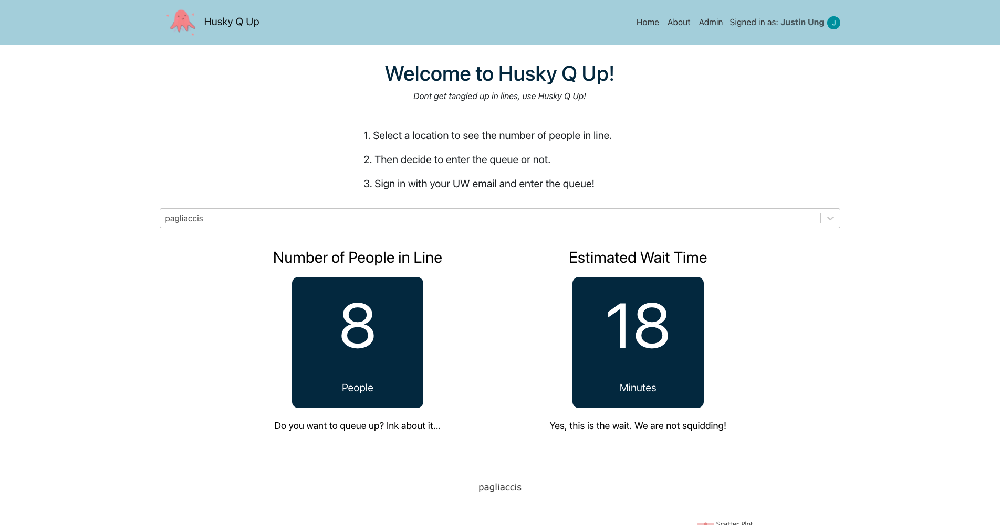
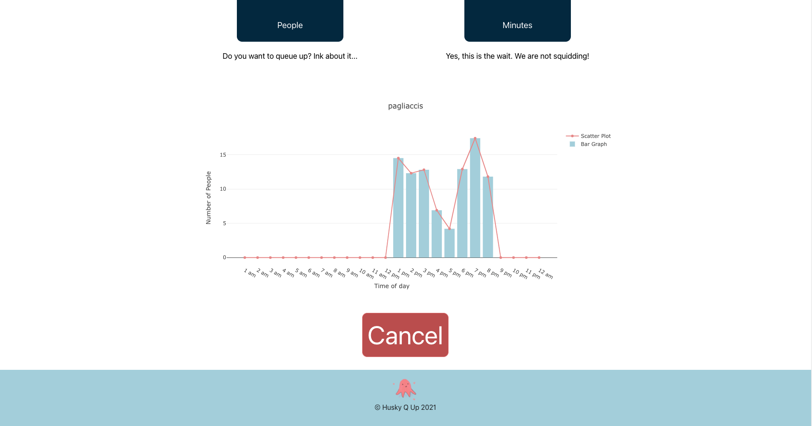

# Husky Q Up
### Dubhacks 2021
<hr/>
<em>Dont get tangled up in lines, use Husky Q Up!</em>. 

Husky Q Up is the perfect solution for students who want to know how long lines are at on-campus dining locations or at front desk!. Clone our repo to play around with it!






## Development

Clone the repo:
```
$ git clone https://github.com/ungjus/Dubhacks-2021.git
```
install dependencies in requirement.txt
```
$ pip freeze > reuquirements.txt
```
Go to the server folder and run ```husky_server.py```
```
$ cd server
$ python husky_server.py
```
Go to the Husky Q Up directory in website Folder and npm install:
```
$ cd website/husky-q-up 
$ npm install 
```

Run website locally with npm start:
```
$ npm start
```

<hr/>

## Contributors: 
- Bryce Nguyen
- Caesar Tuguinay
- Han Nguyen
- Justin Ung
